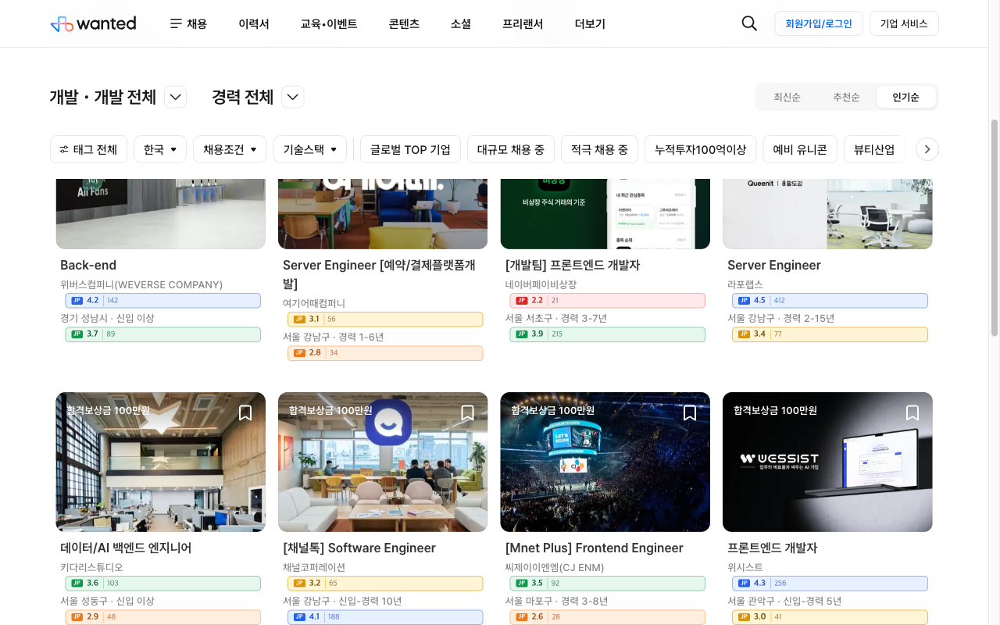
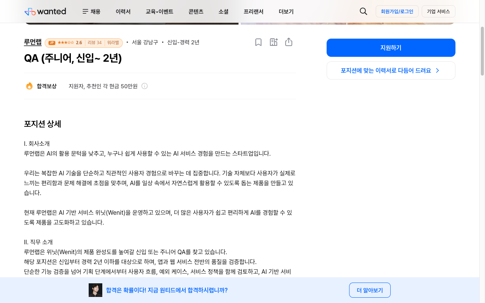

# Wanted × JobPlanet Score

원티드(wanted.co.kr) 채용공고에 **잡플래닛 평점**과 **사람인 평균연봉·영업이익**을 자동으로 보여주는 크롬 확장 프로그램.


채용공고 리스트, 회사 페이지, 홈 화면 어디서나 회사명 옆에 잡플래닛 별점과 리뷰 수가 떠요.

### 미리보기

| 채용공고 리스트 | 공고 상세 |
|---|---|
|  |  |

---

## 🚀 설치 (개발 안 해보신 분도 OK, 1분 컷)

### 1️⃣ 압축 파일 받기
👉 [**최신 버전 다운로드**](https://github.com/junha6316/wanted-jobplanet-score/releases/latest) — 페이지 하단 **Assets**에서 `wanted-jobplanet-score.zip` 클릭

### 2️⃣ 압축 풀기
- **Mac**: 다운로드된 zip 더블클릭
- **Windows**: zip 우클릭 → "압축 풀기"

➜ `wanted-jobplanet-score` 폴더가 생김

### 3️⃣ 크롬에 설치
1. 크롬 주소창에 이거 붙여넣고 엔터:
   ```
   chrome://extensions
   ```
2. **우상단의 "개발자 모드"** 토글 켜기
3. 좌상단 **"압축해제된 확장 프로그램을 로드합니다"** 클릭
4. 방금 압축 푼 폴더 선택

✅ 끝! 이제 https://www.wanted.co.kr 들어가면 자동으로 동작해요.

---

## 어떻게 보이나요?

| 평점 구간 | 색상 | 의미 |
|---|---|---|
| 4.0 ~ 5.0 | 🔵 파랑 | 매우 좋음 |
| 3.5 ~ 3.9 | 🟢 초록 | 좋음 |
| 3.0 ~ 3.4 | 🟡 노랑 | 보통 |
| 2.5 ~ 2.9 | 🟠 주황 | 주의 |
| 0.0 ~ 2.4 | 🔴 빨강 | 비추 |

배지 클릭하면 잡플래닛 회사 페이지로 바로 이동.
호버하면 매칭된 회사명·강점 키워드까지 툴팁으로 나옴.

---

## ❓ 자주 묻는 질문

**Q. 배지가 안 보여요**
- 크롬 확장 페이지에서 우리 익스텐션이 **켜져 있는지** 확인
- 원티드 페이지를 한 번 새로고침 (Cmd/Ctrl + R)
- 그래도 안 보이면 [Issues](https://github.com/junha6316/wanted-jobplanet-score/issues)에 알려주세요

**Q. 평점이 "정보 없음"이라고 떠요**
- 잡플래닛에 해당 회사가 등록 안 되어있거나, 회사명 표기가 다른 경우 (예: 영문 vs 한글)
- "정보 없음" 배지를 클릭하면 잡플래닛 검색 결과로 이동 — 거기서 수동 확인 가능

**Q. 어떻게 잡플래닛에서 평점을 가져오나요?**
- 잡플래닛 사이트에 사용자가 이미 로그인되어 있다면 그 세션을 그대로 사용
- 별도 계정/API 키 필요 없음

**Q. 내 정보가 어디로 전송되나요?**
- 아무 데도 안 보냅니다. 모든 통신은 사용자 브라우저 ↔ 잡플래닛 사이만
- 결과는 본인 컴퓨터에 30일간 캐시되고 자동 삭제

**Q. 끄거나 지우고 싶어요**
- `chrome://extensions`에서 토글로 끄기 또는 **제거** 버튼

---

## ⚠️ 알아두실 점

- 이 프로그램은 **비공식**입니다. 원티드(주식회사 원티드랩), 잡플래닛(주식회사 브레인커머스)과 어떠한 제휴 관계도 없습니다.
- 잡플래닛 사이트 구조가 바뀌면 동작하지 않을 수 있고, 그때는 [Issues](https://github.com/junha6316/wanted-jobplanet-score/issues)에 알려주시면 고치겠습니다 (보장은 못 함).
- 모든 상표권은 각 권리자에게 있습니다.

---

## 🛠 개발자용

소스 직접 빌드/수정하실 분만 보세요.

### 기술 스택
- Manifest V3
- Vanilla JS (빌드 도구 없음)
- `chrome.storage.local` 캐시 (30일)

### 동작 원리
1. **content script**가 페이지에서 회사명 추출
   - 채용 카드 / 회사 카드: `[data-company-name]` 속성에서 직접
   - 상세 페이지: `a[href^="/company/"]` 또는 회사 정보 헤더 텍스트
2. **service worker (background)** 가 잡플래닛 두 엔드포인트 호출
   - `/search/companies?query=...` (Next.js RSC) → 회사 ID + 평점 + 강점
   - `/api/v4/companies/reviews/list?company_id=...` → 리뷰 수
3. content script가 회사명 옆에 배지 inject
4. 결과는 정규화된 회사명 키로 `chrome.storage.local`에 30일 캐시

### 로컬 개발

```bash
git clone https://github.com/junha6316/wanted-jobplanet-score.git
```

위의 설치 가이드 3단계와 동일하게 `chrome://extensions`에서 로드.

코드 수정 후 `chrome://extensions`의 새로고침(↻) 아이콘 클릭하면 반영.

### 디버깅

`chrome://extensions` → 카드의 **"서비스 워커"** 클릭 → Console에서 `[WJP]` 로그 확인.

캐시 비우기:
```js
chrome.storage.local.clear()
```

### 패키지 빌드

```bash
zip -r wanted-jobplanet-score.zip . -x "*.git*" "*.DS_Store" "README.md" "LICENSE" "*.zip"
```

---

## License

MIT — [LICENSE](LICENSE) 참조.
